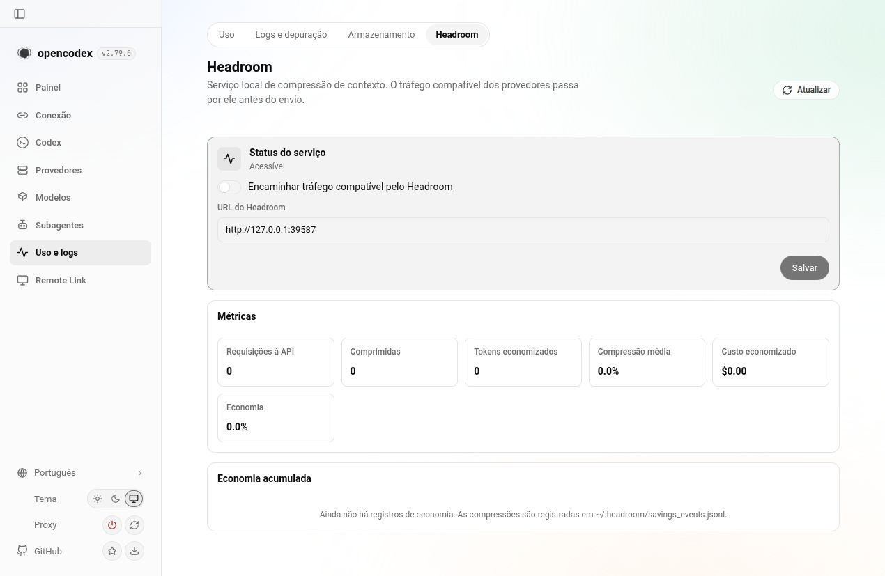
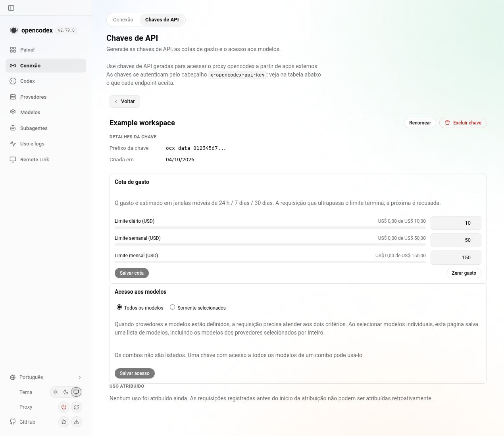

# OpenCodex Haly integration with stable v2.78.0

Source commit: `5f1052c00a39d8154a438768c45acfbee3af3783`.
Stable upstream: `v2.78.0` (`93cdffd6ac7f125d4b932a6d45af5c3ab1de5156`).
Package development version: `2.79.0`; bundled RTK: `0.50.0`.

The merge retains the previous Haly/RTK candidate as an ancestor and carries the stable 2.78 changes. API keys remain a dedicated page under Connect; Headroom belongs to Usage & Logs. The upstream eight-group sidebar and new Claude controls remain available. The new Portuguese locale includes all 83 extension strings.

## Current-head checks

Passed with the pinned Bun 1.4.0 runtime:

- TypeScript typecheck.
- GUI build, lint and i18n lint.
- Documentation build.
- Structure SSOT, file-size ratchet, generated CLI skill surface and privacy scan.
- Syntax compilation of 1,112 changed TypeScript files, including existing test sources; this did not execute those tests.
- Package preparation and inspection: five RTK executables with executable modes, LICENSE/NOTICE, GUI assets and generated compatibility metadata.
- Integration delta whitespace check against v2.78.0. Existing upstream trailing blank lines were retained outside that delta.

Automated unit/integration test suites, Windows/macOS execution, live provider inference, independent security review and full required CI remain pending for this head. Historical passing tests for the older candidate are not claimed for this merge.

## Screenshots

These show the built candidate in an isolated local fixture with synthetic providers and a synthetic key. The Portuguese Headroom page and API-key quota/model-scope details rendered without browser error/warning entries during capture. No real credentials, active user configuration, provider inference or production service were used for the screenshots. The images establish UI rendering only. The fixture logged an Anthropic model-discovery HTTP 401; this is not evidence of successful provider discovery or inference.

## Review gates

PR #3 remains draft. Haly's repository has not published a new release or advanced its dev branch since the prior integration. The contributor account has read-only access there. Authentication, dependency and release surfaces still require maintainer sponsorship and explicit independent security review. CodeRabbit's draft status is not independent-review evidence.
